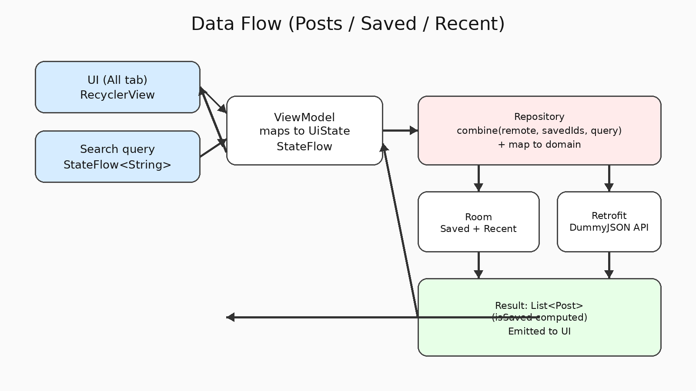

# PostsLite

A lightweight **offline-first** Android app that fetches posts from a remote API, allows users to **search**, **save posts locally**, and track **recently opened** posts — optimized for legacy devices (**minSdk 19**).

---

## Highlights

- **Tabs:** All / Saved / Recent
- **Search:** filter posts by title/body (debounced)
- **Saved posts:** stored locally using Room (offline)
- **Bulk actions (Saved):** Select All / Clear selection / Delete with confirmation
- **Undo delete:** Snackbar with real restore
- **Recent:** last opened posts (timestamped) + **Clear Recent** from Settings
- **Settings:** Clear all Saved, Clear Recent, About section

---

## Multi-module Architecture

This project is split into **3 Gradle modules**:

- `:app` → UI layer (Fragments, ViewModels, navigation, Hilt entry points)
- `:domain` → pure Kotlin (models + repository interface)
- `:data` → repository implementation + Room + Retrofit + mappers

### Diagram

  

  

---

## Tech Stack

- **Kotlin**
- **Clean Architecture** (app / domain / data)
- **MVVM** (ViewModels + StateFlow)
- **Coroutines + Flow**
- **Hilt** (Dependency Injection)
- **Room** (offline storage)
- **Retrofit + OkHttp** (networking)
- **Material Components**
- **Gradle Kotlin DSL** + **Version Catalog (TOML)**

---

## Modules & Responsibilities

### `domain`
- `Post` model
- `PostsRepository` interface (contract)

### `data`
- Retrofit DTOs (`PostDto`, `PostsResponseDto`) + API interface (`PostsApi`)
- Room entities (`PostEntity`, `RecentEntity`) and DAOs (`PostDao`, `RecentDao`)
- `PostsRepositoryImpl`:
  - fetches remote posts (once)
  - observes saved/recent from Room
  - combines flows to produce `Post(isSaved = ...)`
  - applies search filtering + debounce
- Mappers between layers (`dto -> domain`, `domain -> entity`)

### `app`
- UI Fragments:
  - `HomeTabsFragment` (TabLayout + ViewPager2)
  - `PostsFragment` (All)
  - `SavedFragment` (Saved + selection + undo)
  - `RecentFragment` (Recent opened)
  - `DetailsFragment` (details + save toggle)
  - `SettingsFragment` (clear saved / clear recent)
- ViewModels with `UiState` using `StateFlow`

---

## SOLID / Refactor Notes (What Changed)

- Moved the app from **single-module** to **multi-module** (app/domain/data) to improve separation of concerns.
- Repository was simplified by:
  - keeping **domain** clean (no Android dependencies)
  - isolating Room/Retrofit inside **data**
  - using mappers instead of mixing DTO/Entity/Domain models
- UI state updates were unified (less repetitive `visibility` code) using a single state-driven render approach.

---

## Screenshots

> Place screenshots in: `app/screenshots/` (or update paths below to match your repo)

| Screen | File |
|---|---|
| All posts | `01_all.png` |
| Search | `02_search.png` |
| Details | `03_details.png` |
| Saved | `04_saved.png` |
| Delete confirm | `05_saved_undo.png` |
| Undo snackbar | `06_saved_undo.png` |
| Undo result | `07_saved_undo.png` |
| Saved after restore | `08_saved_undo.png` |
| Recent | `09_recent.png` |
| Settings | `10_settings.png` |

---

## API Source

- DummyJSON API: `https://dummyjson.com/posts`

---

## How to Run

1. Open the project root folder `PostsLite` in Android Studio
2. Sync Gradle
3. Run on emulator/device (minSdk 19)

---

## Future Improvements

- Pagination for posts
- Caching remote results with expiry (avoid re-fetch per cold start if desired)
- Better Saved selection UX (long-press selection mode)
- Unit tests for repository + mappers
- UI polishing (animations + empty states + accessibility)
