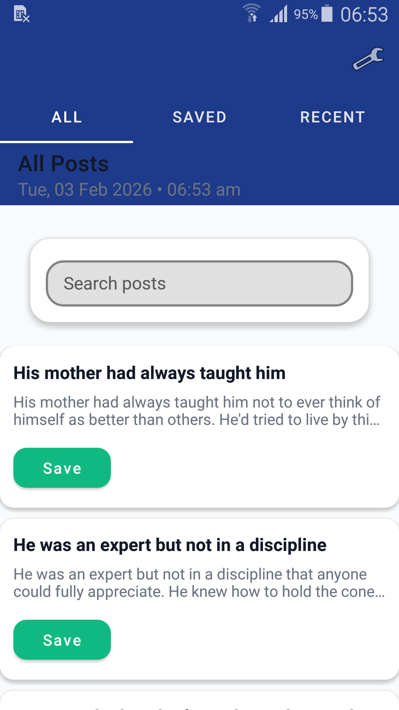
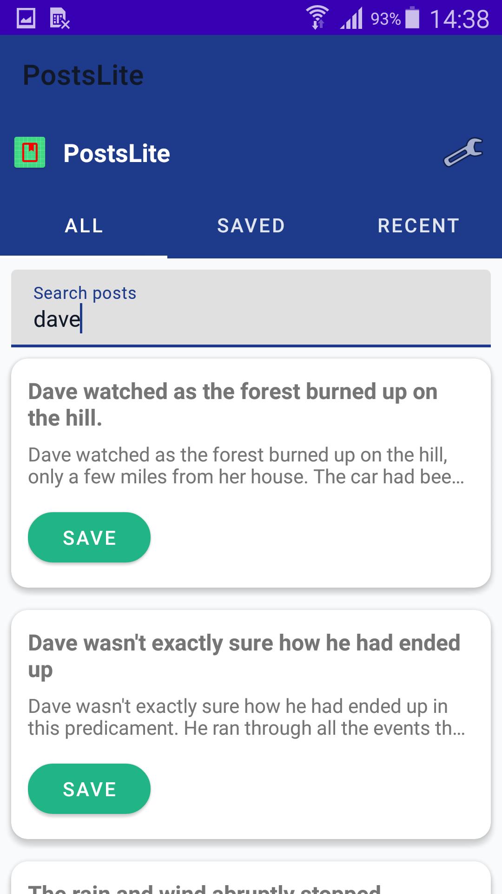
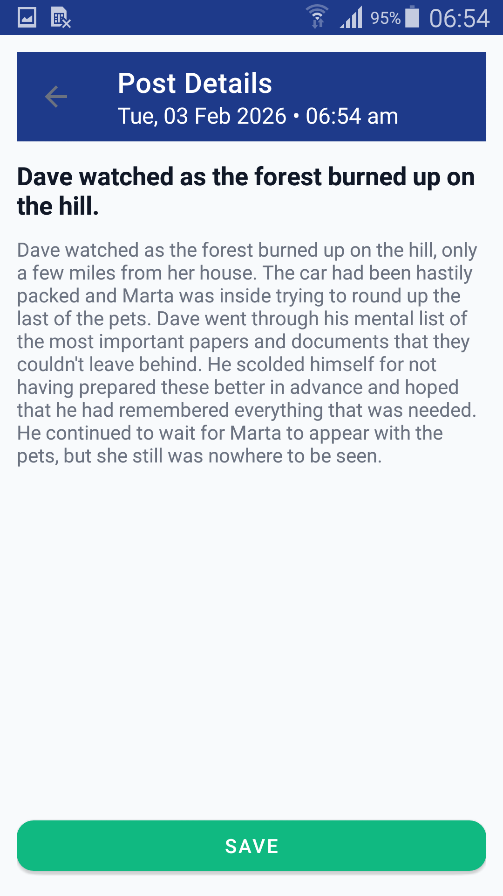
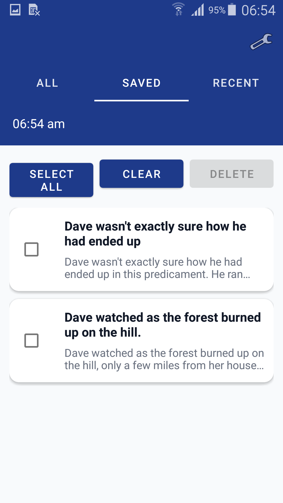
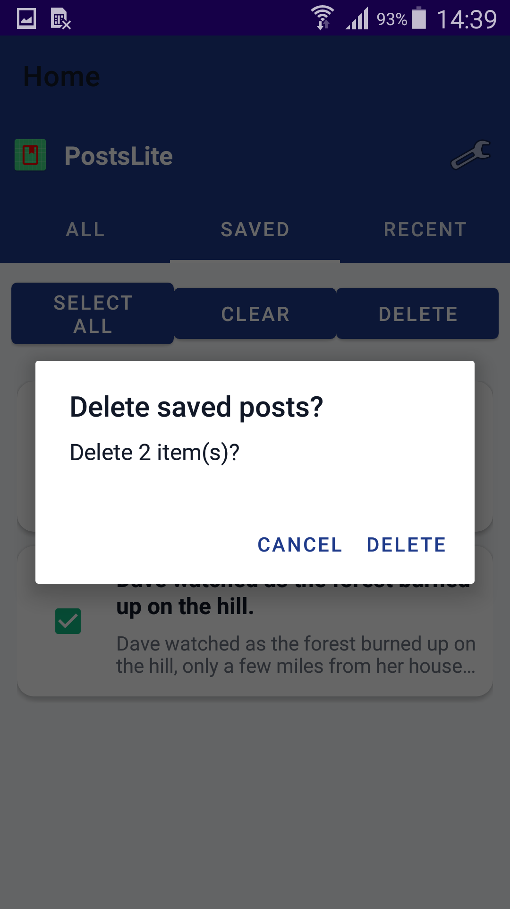
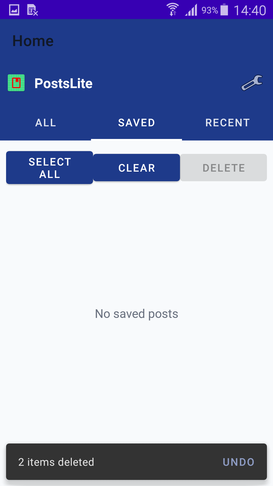
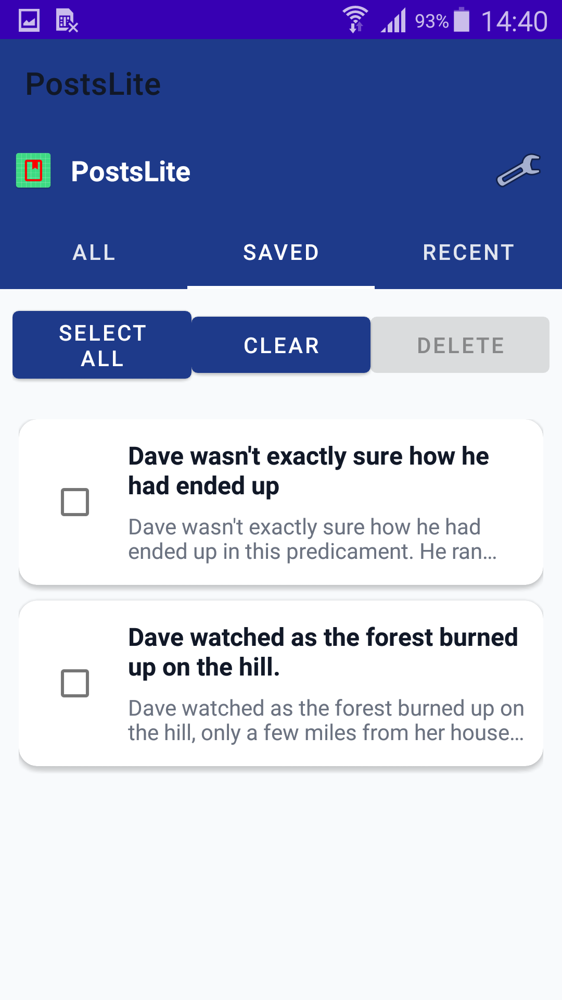

# PostsLite


Lightweight Android application built with **Kotlin** following **Clean Architecture (Multi-Module)** principles.

PostsLite is an offline-first Android app that demonstrates modern Android development best practices including reactive state management, clean separation of layers, scalable architecture, and optimized performance for legacy devices.

---

# 🚀 Features

- Browse posts from remote API
- Real-time search filtering
- Save / Unsave posts
- Centralized Undo system (single & bulk delete)
- Recently opened posts tracking
- Offline-first architecture using Room
- Reactive UI powered by Kotlin Flow
- Multi-module clean architecture
- Optimistic UI updates
- Memory leak safe implementation

---

# 🏗 Architecture

The project follows Clean Architecture with multi-module separation:

```
:app     → UI Layer (Fragments, ViewModels)
:data    → Repository, API, Room, Mappers
:domain  → Business Logic, UseCases, Interfaces
```

### Why Multi-Module?

- Clear separation of concerns
- Better scalability
- Easier maintainability
- Testable business logic
- Enforced dependency direction (UI → Domain → Data)
- Follows SOLID principles
- Production-ready architecture pattern

---

# 📐 Architecture Diagram

<p align="center">
  
</p>

---

# 🔄 Data Flow Diagram

<p align="center">
  
</p>

---

# 🧠 Tech Stack

- Kotlin
- MVVM
- Clean Architecture
- Multi-Module Project
- Hilt (Dependency Injection)
- Retrofit (Networking)
- OkHttp
- Room Database
- Coroutines + Flow
- Version Catalog (TOML)
- Gradle Kotlin DSL (KTS)
- Java 17 Compatibility

---

# 🌐 API Source

Posts are fetched from:

```
https://jsonplaceholder.typicode.com/posts
```

Endpoint used:

```
GET /posts
```

---

# 🔁 Data Mapping (Converter)

The project uses a Mapper pattern to separate layers:

```
PostDto (Network)
        ↓
toDomain()
        ↓
Post (Domain Model)
        ↓
toEntity()
        ↓
PostEntity (Room)
```

This guarantees:

- Domain layer is completely independent
- Data layer handles conversion logic
- UI never depends on API models directly
- Clear responsibility per layer
- Strict dependency direction

---

# 📦 Modules Breakdown

## 1️⃣ Domain Module
- Repository interface
- Business models
- UseCases
- Pure Kotlin (no Android dependencies)
- Core business rules

---

## 2️⃣ Data Module
- Retrofit API
- Room Database
- DAO
- Mappers
- Repository Implementation
- Data sources (Remote & Local)

Depends only on:
- Domain

---

## 3️⃣ App Module
- Fragments
- ViewModels
- UI State Management
- RecyclerView Adapters
- Navigation Component
- DI Modules
- Toolbar & UI Architecture

Depends on:
- Domain
- Data

---

# 📱 Application Screens

## 📰 All Posts

<p align="center">
  
</p>

---

## 🔍 Search

<p align="center">
  
</p>

---

## 📄 Post Details

<p align="center">
  
</p>

---

## ❤️ Saved Posts

<p align="center">
  
</p>

---

## ♻️ Save / Undo Flow

<p align="center">
  
  
</p>

<p align="center">
  
  
</p>

---

## 🕒 Recent Posts

<p align="center">
  
</p>

---

## ⚙️ Settings

<p align="center">
  
</p>

---

# ⚙️ Gradle Setup

- Converted from Groovy → Kotlin DSL (KTS)
- Uses Version Catalog (`libs.versions.toml`)
- Structured as Multi-Module
- Cleaned and optimized build configuration
- Compatible with Java 17
- Optimized dependency management

---

# 🧩 Engineering Decisions

- Toolbar centralized in Activity for better navigation architecture
- Reactive repository using Flow + combine()
- Applied `distinctUntilChanged()` to optimize UI emissions
- Centralized Undo system using SharedFlow
- Optimistic UI updates for Save/Unsave
- Memory leak prevention via ViewBinding lifecycle cleanup
- Clear UI state rendering using sealed classes
- Strict layer separation enforcement

---

# 🔮 Future Improvements

- Unit tests for Domain layer
- UI tests using Espresso
- Paging 3 integration
- Swipe-to-delete with animation
- Dark mode refinements
- CI/CD integration
- GitHub Actions setup
- Compose migration version

---

# ▶️ How to Run

1. Clone the repository
2. Open in Android Studio (Giraffe+ recommended)
3. Sync Gradle
4. Run on emulator or physical device

---

# 📱 Compatibility

- Minimum SDK: 19
- Optimized for legacy devices
- Offline-first behavior
- Lightweight performance footprint
- Efficient memory usage

---

# 📌 Project Purpose

This project demonstrates:

- Clean Architecture in Android
- Multi-Module structure
- Proper repository pattern
- Dependency Injection with Hilt
- Reactive UI with Flow
- Separation between network, database, and domain models
- Scalable Android project setup
- Production-level architectural thinking

---

