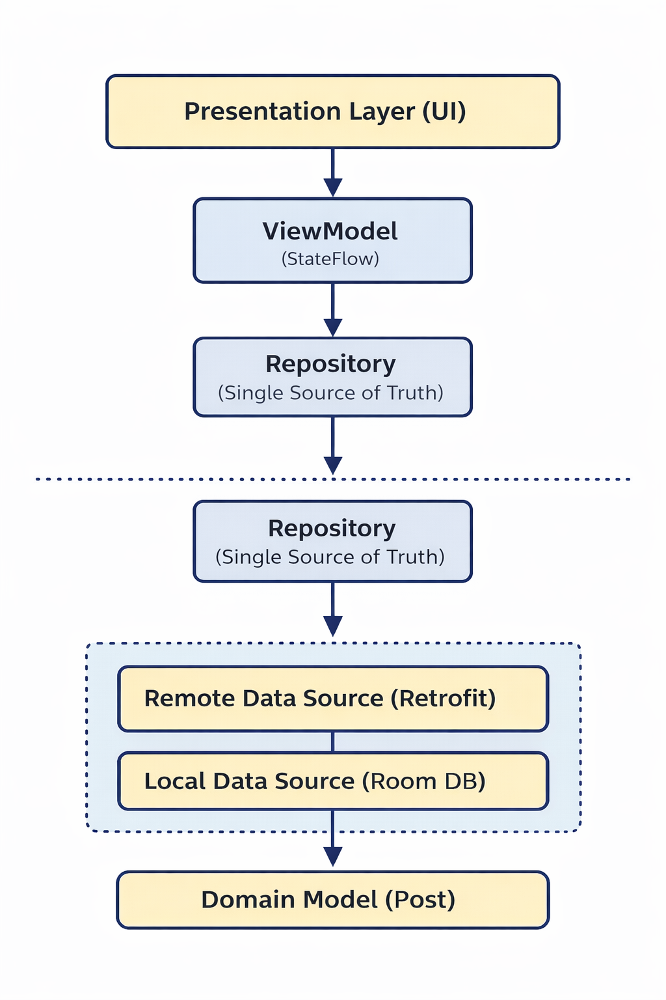
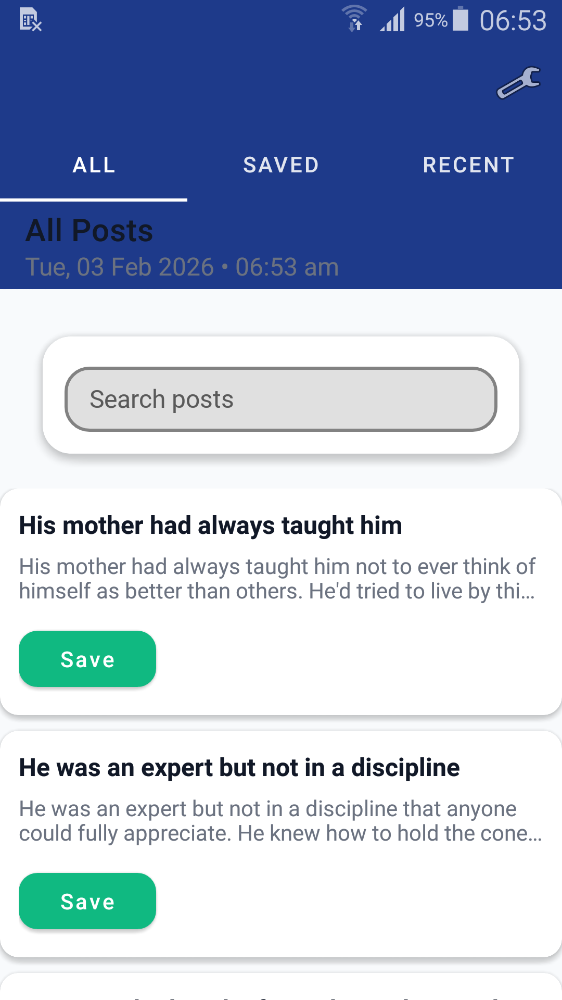
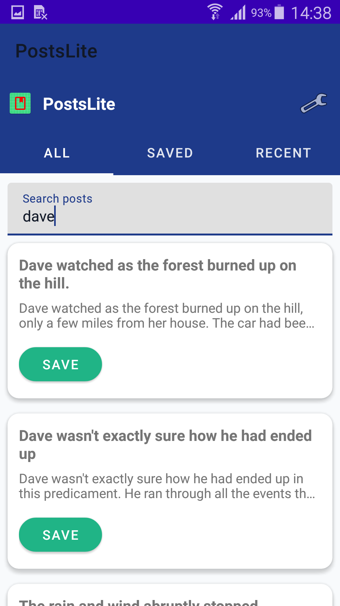
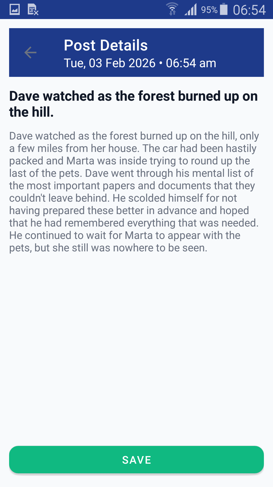
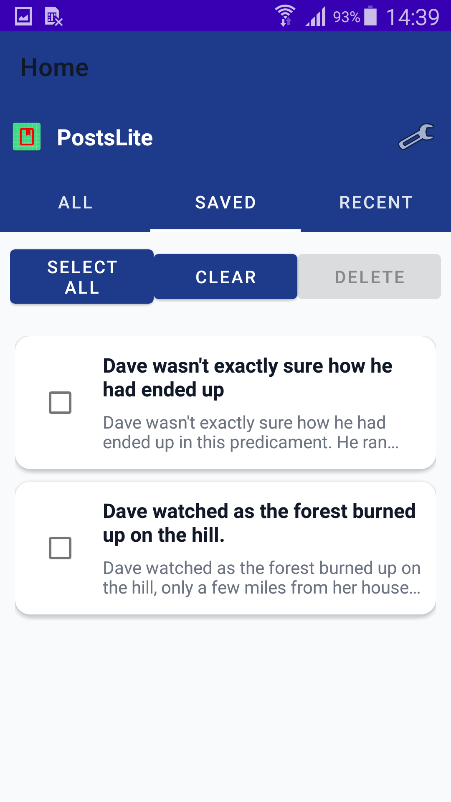
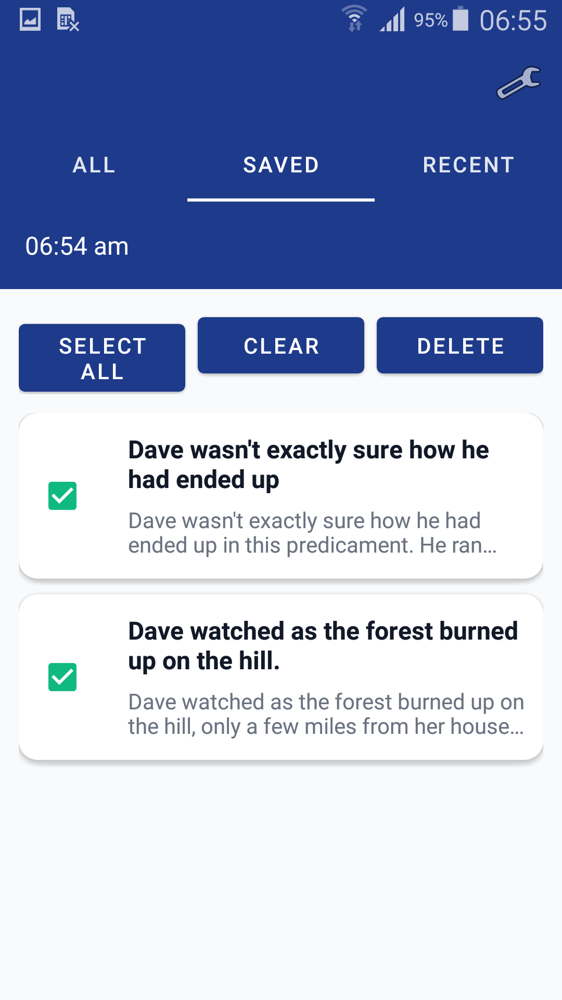
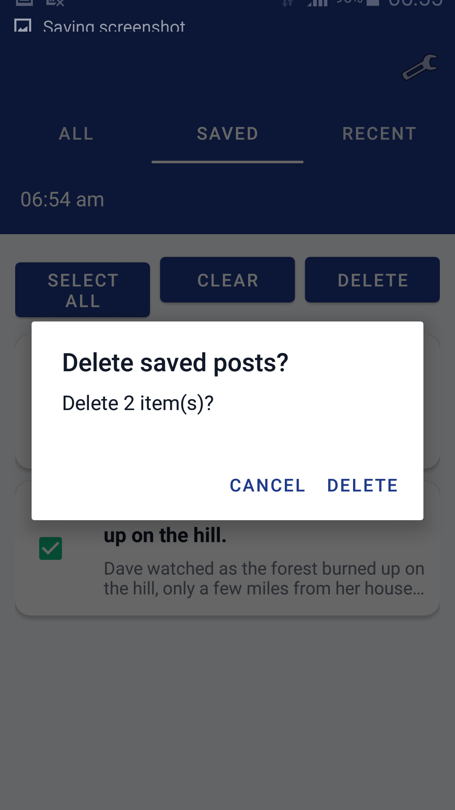
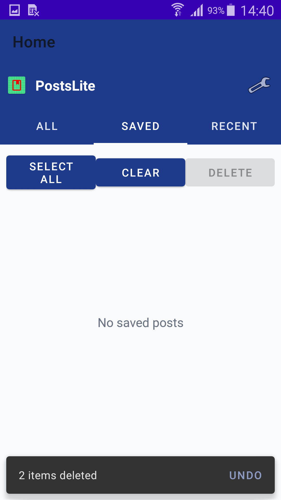
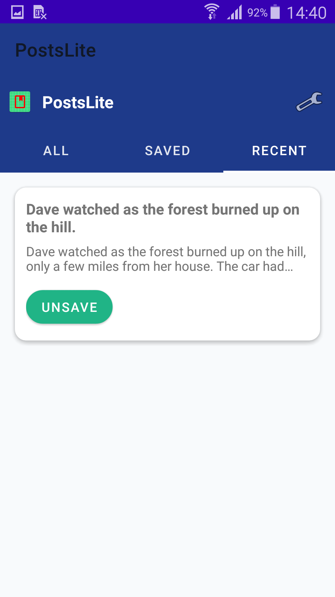
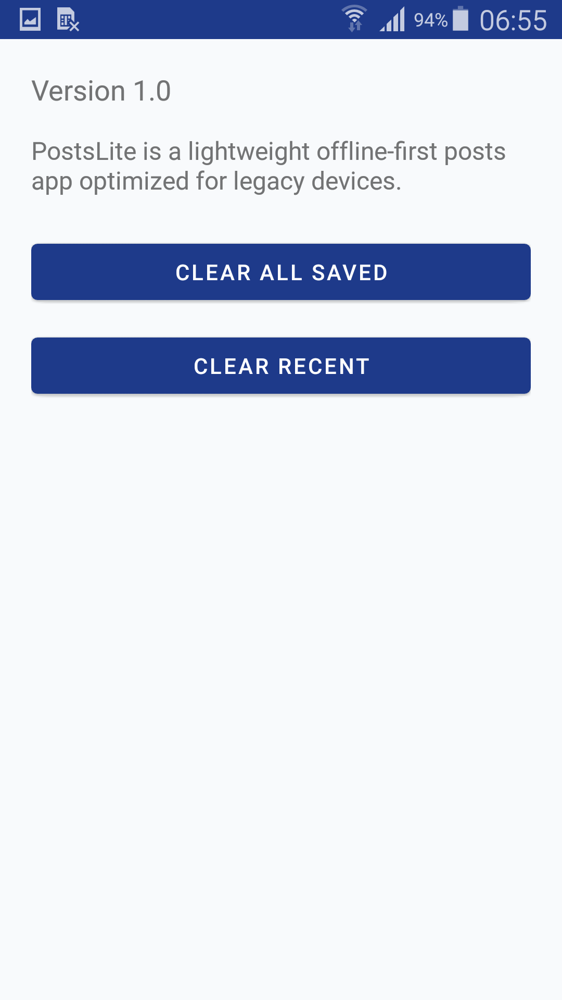

# PostsLite

PostsLite is a lightweight offline-first Android application optimized for legacy devices (Min SDK 19).

The app allows users to browse posts, search through content, save posts offline, and track recently opened posts.

---

## Features

- Tabs: **All / Saved / Recent**
- Search posts by title or body
- Post details screen
- Save / Unsave posts using Room database
- Recent tab shows last opened posts
- Multi-select saved posts (Select All / Clear / Delete)
- Delete confirmation + Undo restore
- Settings screen:
    - Clear all saved posts
    - Clear recent history
    - About app

---

## Tech Stack

- Kotlin
- MVVM Architecture
- Clean Architecture (data / domain / presentation)
- Hilt Dependency Injection
- Room Database (Offline storage)
- Retrofit (Networking)
- Coroutines + Flow
- Navigation Component
- Material UI Components

---
## Architecture Overview

PostsLite follows a clean MVVM-based architecture:
---
## Architecture Diagram

  

## Compatibility

- Minimum SDK: **19 (Android 4.4)**
- Designed for smooth performance on older Android phones  
  (Tested on Samsung Galaxy Note 3)

---

## Screenshots

### Main Screens

| All Posts | Search | Details |
|----------|--------|---------|
|  |  |  |

---

### Saved Posts

| Saved List |
|-----------|
|  |

---

### Delete & Undo Flow

| Selection Mode | Delete Confirmation |
|---------------|---------------------|
|  |  |

| Snackbar Undo | Restored State |
|-------------|----------------|
|  |  |

---

### Recent & Settings

| Recent Tab | Settings Screen |
|-----------|----------------|
|  |  |

---

## API Source

DummyJSON API:

